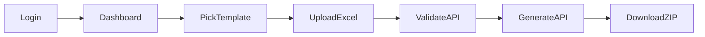

# Architect

## Stack
Next.js App Router, TypeScript, Tailwind, jose (JWT cookie), xlsx, jszip.

## Flow

## Hosting
Vercel serverless. Templates traced via `outputFileTracingIncludes`.
Generate capped by `maxDuration` + `MAX_GENERATE_ROWS`.
